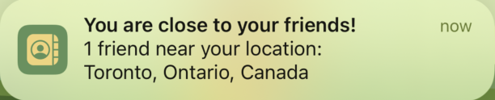
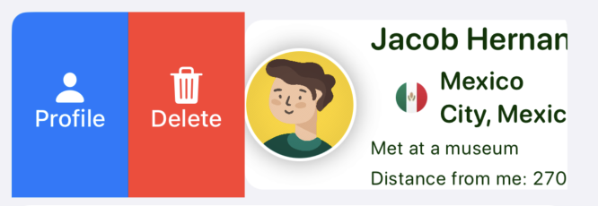
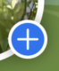
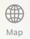
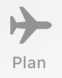
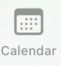
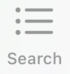

# User Guide

Welcome to our Contact Management ConXCord App! This app is designed to help you manage your contacts efficiently.  
  
Here is a guide on how to use our app:

## Table of Contents

- [Installation](#installation)
- [Pre-loaded Data](#pre-loaded-data)
- [Notification for Nearby Contacts](#notification-for-nearby-contacts)
- [Main View](#main-view)
    - [Adding a Contact](#adding-a-contact)
    - [Viewing a Contact Profile](#viewing-a-contact-profile)
    - [Editing a Contact](#editing-a-contact)
    - [Deleting a Contact](#deleting-a-contact)
    - [Flagging a Contact](#flagging-a-contact)
    - [Filtering Contacts](#filtering-contacts)
    - [Adding a Profile Picture for You](#adding-a-profile-picture-for-you)
    - [Voice Assistant](#voice-assistant)
- [Map View: Viewing Contacts in World Map](#map-view-viewing-contacts-in-world-map)
- [Plan View: Making Trip Plans](#plan-view-making-trip-plans)
- [Calendar View: Viewing Plans in Calendar](#calendar-view-viewing-plans-in-calendar)
- [Search View: Viewing All Contacts and Searching](#search-view-viewing-all-contacts-and-searching)

## Installation

To use the app, clone a project from GitLab to Xcode and run it on a device.

## Pre-loaded Data

The app comes pre-loaded with 15 contacts with generated details, including the contact's first and last name, city, state, country, email, phone number, and notes. Additionally, the app will upload about 50k city [geolocations](https://simplemaps.com/data/world-cities) to core data once launched.

## Notification for Nearby Contacts

If you enter a circular region within a 100-kilometer radius of your contacts' location, you will receive a notification for the number of nearby contacts.

## Main View

In the Main View, you will see a list of all contacts with their respective names, city, and country and the distance between you and the contact. Tap on a contact to edit their details.

### Adding a Contact

To add a new contact, navigate to the Add view  and fill out the required fields, which include the contact's first and last name, email, phone number, and city. You can also search for the contact's city, state, and country by clicking on the Find Location button, which will use an external API to find matching results([Reference to tutorial used](https://www.youtube.com/watch?v=dJ6f2o92tKg)). You can load picture from phone library. You can also load contact details from phone contacts if it is available. You can add notes related to contact. Once you have filled out all the necessary fields, click Confirm to add the contact.

### Viewing a Contact Profile

To view contact profile, swipe left on the contact you wish to view. Click on the Profile button to bring up the Contact's Profile view. You can export contact to Phone Contacts, make a call or send an email if phone number or email are available.

### Editing a Contact

To edit a contact, tap on a contact you wish to edit. You can make changes to any of the fields and then click Confirm to save the changes.

### Deleting a Contact

To delete a contact, navigate to the Contacts tab and swipe left on the contact you wish to delete. Click on the Delete button to delete the contact. 

### Flagging a Contact

You can flag a contact as "to be visited" by toggling the switch in the Edit Contact view. The contact's flag status will be displayed as a picture of the flag in the Contact View.

### Filtering Contacts

You can filter your contact list by clicking on the Filter button in the Contacts tab. You can choose to filter contacts by those flagged as "to be visit"  or  those within 70 km of your current location.

### Adding a Profile Picture for You

To add a profile picture, click on the blue plus button  in the Contact tab, select picture from your photo library and then click on the Choose button.

### Voice Assistant

Our app also features a voice assistant that can help you schedule reminders. To use the voice assistant, navigate to the Voice Assistant view  and speak your reminder into the microphone. The app will use Apple's voice recognition technology and GPT-3's language processing to extract relevant information from your speech and schedule a reminder accordingly.

## Map View: Viewing Contacts in World Map

 When clicking the Map tab , you can view all your contacts in selectable map markers with show your location and add contact buttons. Once the marker is pressed, you can view a list of contacts detail for a specific city. Also, the search bar at the top allows you to search for your contacts based on city, state and country. Once the search is completed, you will be directed to the highlighted map marker in the corresponding city.  
 Sometimes you may get a purple warning in this view: "[SwiftUI] Publishing changes from within view updates is not allowed, this will cause undefined behavior" This is because of the bug in SwifitUI MapKit, please refer to this link for detail: https://developer.apple.com/forums/thread/718697

## Plan View: Making Trip Plans

When clicking the Plan tab , you can make a trip plan and view all your plan list. 

### Making a Plan

When clicking "Make a Plan" button , you can enter the start/end date, the city and choose the people you want to visit (turn on the toggle) to make a plan.   
Please use "search city" to auto-enter the city information, to make sure it can match with the format in the database.

### View the Plan List
Then, you can go back and view this plan on the Plan View. You can see the plan detail by clicking "see detail" on each plan card and swipe to delete a completed one.

## Calendar View: Viewing Plans in Calendar

When clicking the calendar tab , you can view all your plans in a FSCalendar. When clicking a date with blue dots which represent the number of events, you can view all the plan details for this date. 

## Search View: Viewing All Contacts and Searching

When clicking the Search tab , you can view all the contacts in the database and you can search on any content like their name, city and the notes.
